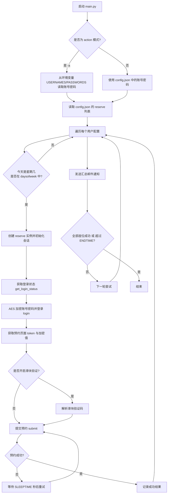

# JSU 超星图书馆座位自动预约工具

基于 Python 的超星学习通（Chaoxing）图书馆座位自动预约脚本。支持**本地运行**和 **GitHub Actions 定时自动预约**两种方式，预约成功后可通过邮件通知结果。

> ⚠️ **免责声明**：本项目仅供学习交流使用，请遵守学校图书馆的相关规定，合理使用，切勿滥用或用于任何商业用途。因使用本脚本产生的一切后果由使用者自行承担。

---

## 目录

- [一、项目简介](#一项目简介)
- [二、功能特性](#二功能特性)
- [三、目录结构](#三目录结构)
- [四、核心工作流程（全流程）](#四核心工作流程全流程)
- [五、环境依赖](#五环境依赖)
- [六、配置文件说明](#六配置文件说明)
- [七、本地运行](#七本地运行)
- [八、GitHub Actions 自动预约](#八github-actions-自动预约)
- [九、关键参数说明](#九关键参数说明)
- [十、常见问题](#十常见问题)

---

## 一、项目简介

本项目用于自动登录超星（学习通）图书馆座位预约系统，并在开放预约的时间点自动抢占指定房间、指定座位。脚本通过逆向超星登录与预约接口、使用 AES 加密账号密码、模拟移动端请求完成预约，同时支持：

- 多账号、多座位并行预约；
- 按星期几自动判断当天是否需要预约；
- 超长时段（超过 5 小时）自动切分；
- 预约成功后自动发送邮件通知。

## 二、功能特性

| 特性 | 说明 |
| --- | --- |
| 自动登录 | 使用 AES 加密账号密码，模拟超星登录接口 |
| 定时抢座 | 主循环从启动时间一直重试到 `ENDTIME`，抢占开放瞬间的座位 |
| 多账号支持 | `USERNAMES` / `PASSWORDS` 环境变量逗号分隔，支持多人 |
| 星期过滤 | 每个座位可配置 `daysofweek`，仅在指定星期预约 |
| 时段切分 | 单次预约超过 5 小时自动拆分为多个时段 |
| 邮件通知 | 预约成功后合并所有结果，通过 SMTP 发送邮件 |
| 双端运行 | 支持本地 Python 直接运行与 GitHub Actions 云端定时运行 |
| 滑块验证（可选） | 可开启滑块验证码自动识别（需额外依赖） |

## 三、目录结构

```
.
├── main.py                 # 程序入口：参数解析、主预约循环、调试/探测模式
├── config.json             # 用户配置（座位/时段/邮件等，已被 .gitignore 忽略）
├── config.example.json     # 配置文件模板（可复制后修改）
├── requirements.txt        # Python 依赖清单
├── chaoxing.bat            # Windows 批处理一键运行脚本
├── utils/
│   ├── __init__.py         # 导出 get_user_credentials（读取环境变量账号密码）
│   ├── encrypt.py          # AES 加密、MD5 签名、滑块验证码 key 生成
│   └── reserve.py          # reserve 类：登录、获取 token、提交预约、发送邮件
└── .github/
    └── workflows/
        └── reserve.yml     # GitHub Actions 定时自动预约工作流
```

## 四、核心工作流程（全流程）

一次完整的预约执行流程如下：



**关键环节说明：**

1. **登录**：账号密码先经过 `AES_Encrypt` 加密，再通过 `passport2.chaoxing.com/fanyalogin` 接口登录。
2. **获取 token**：从预约页面提取 `submit_enc` 隐藏域的值，作为后续提交的加密种子。
3. **提交预约**：对预约参数按键排序后拼接，计算 MD5 签名（`verify_param`），再 POST 到预约接口。
4. **主循环**：`main()` 会不断重试，直到所有座位预约成功或超过 `ENDTIME`（默认 08:01:00）。

## 五、环境依赖

- Python 3.8+（建议 3.11）
- 依赖包：`requests`、`cryptography`

安装依赖：

```bash
pip install -r requirements.txt
```

> 若需要开启滑块验证（`ENABLE_SLIDER = True`），请取消 `requirements.txt` 中 `numpy` 和 `opencv-python-headless` 的注释后再安装。

## 六、配置文件说明

复制 `config.example.json` 为 `config.json`，然后按需修改：

```json
{
  "reserve": [
    {
      "username": "学号/手机号",
      "password": "密码",
      "time": ["08:00", "21:30"],
      "roomid": "12888",
      "seatid": ["133"],
      "daysofweek": ["Monday", "Tuesday", "Wednesday", "Thursday", "Friday", "Saturday", "Sunday"]
    }
  ],
  "mail": {
    "host": "smtp.qq.com",
    "port": 465,
    "secure": true,
    "auth": {
      "user": "你的邮箱@qq.com",
      "pass": "邮箱授权码"
    }
  },
  "receivers": ["收件邮箱@example.com"]
}
```

| 字段 | 说明 |
| --- | --- |
| `reserve` | 预约列表，每个元素代表一个预约任务 |
| `reserve[].username` | 账号（本地模式使用；Action 模式被环境变量覆盖） |
| `reserve[].password` | 密码（同上） |
| `reserve[].time` | 预约时段 `[开始, 结束]`，超过 5 小时自动切分 |
| `reserve[].roomid` | 房间 ID（可用 `-m room` 模式探测） |
| `reserve[].seatid` | 座位号数组，可写多个 |
| `reserve[].daysofweek` | 预约的星期（英文首字母大写），空数组表示每天 |
| `mail` | SMTP 邮件配置，预约成功后发送通知 |
| `receivers` | 收件人邮箱列表 |

> **注意**：`config.json` 已被 `.gitignore` 忽略，请勿提交到仓库，避免泄露账号密码和邮箱授权码。

## 七、本地运行

### 1. 直接运行

```bash
# 正式预约（读取 config.json 中的账号密码）
python main.py

# 调试模式：单次预约并发送邮件
python main.py -m debug

# 探测房间 ID（交互式输入）
python main.py -m room
```

### 2. 命令行参数

| 参数 | 说明 |
| --- | --- |
| `-u, --user` | 指定配置文件路径，默认 `config.json` |
| `-m, --method` | 运行模式：`reserve`（默认）/ `debug` / `room` |
| `-a, --action` | 开启 GitHub Actions 模式（从环境变量读取账号密码，并做时区校正） |

### 3. Windows 批处理

`chaoxing.bat` 是一个 Windows 一键运行脚本，请先按自己的环境修改其中的 Python 路径和项目路径：

```bat
@echo off
cd 你的项目路径
"你的python.exe路径" main.py >> run_log.txt 2>&1
```

## 八、GitHub Actions 自动预约

### 1. 工作流文件

工作流位于 `.github/workflows/reserve.yml`，已配置：

- **定时触发**：每天**北京时间 06:00** 自动执行（GitHub cron 基于 UTC，故写成 `0 22 * * *`，对应 UTC 22:00 = 北京时间 06:00）。
- **手动触发**：可在仓库 Actions 页面点击 `Run workflow` 手动运行，并选择 `reserve` 或 `debug` 模式。
- **环境变量注入**：

```yaml
env:
  USERNAMES: ${{ secrets.USERNAMES }}
  PASSWORDS: ${{ secrets.PASSWORDS }}
```

### 2. 配置 Secrets

在 GitHub 仓库 **Settings → Secrets and variables → Actions → New repository secret** 中添加以下三个 Secret：

| Secret 名称 | 内容 |
| --- | --- |
| `USERNAMES` | 多个账号用英文逗号分隔，如 `20230001,20230002` |
| `PASSWORDS` | 多个密码用英文逗号分隔，与 `USERNAMES` **顺序一一对应** |
| `CONFIG_JSON` | 完整的 `config.json` 内容（含房间/座位/时段/邮件配置） |

> **顺序要求**：`USERNAMES` 中账号的顺序必须与 `CONFIG_JSON` 中 `reserve` 列表的顺序一致；`PASSWORDS` 同理与 `USERNAMES` 一一对应。

### 3. 时区说明

- 脚本内置了 +8 时区偏移，`-a` 模式下 `get_current_time` 使用 `time.time() + 8*3600` 计算北京时间，`get_submit` 中也对 UTC 运行环境做了日期校正。
- 因此 GitHub Actions 的 runner 保持默认 UTC 即可，**无需**额外设置 `TZ` 环境变量。

## 九、关键参数说明

以下参数位于 `main.py` 顶部，可按需修改：

| 参数 | 默认值 | 说明 |
| --- | --- | --- |
| `STARTTIME` | `"08:00:00"` | 预约正式开放时间（开始时间，北京时间），到点后才正式提交预约 |
| `LOGIN_AHEAD` | `5` | 提前多少秒开始登录（开始登录时间 = `STARTTIME - LOGIN_AHEAD` 秒） |
| `SLEEPTIME` | `0.5` | 每次尝试的间隔秒数 |
| `ENDTIME` | `"08:01:00"` | 停止尝试的时间（北京时间） |
| `ENABLE_SLIDER` | `False` | 是否启用滑块验证 |
| `MAX_ATTEMPT` | `2` | 单次预约的最大尝试次数 |
| `RESERVE_NEXT_DAY` | `True` | 是否预约次日座位 |

### 预约时间轴（脚本内部流程）

```
启动(工作流 06:00)
   │  等待当前时间到达登录开始时间（STARTTIME - LOGIN_AHEAD = 07:59:55）
   ▼
07:59:55  —— 开始登录（只登录，不提交预约）
   │  等待当前时间到达 STARTTIME
   ▼
08:00:00  —— 正式提交预约（主循环不断重试）
   │
   ▼
08:01:00  —— 超时停止（ENDTIME），发送邮件通知
```

> 脚本会先**等待到登录开始时间**再登录，再**等待到开放时间**才正式提交预约，避免过早请求被拒绝。

## 十、常见问题

**Q1：为什么 GitHub 工作流里没有 `config.json` 会报错？**
`main.py` 和 `reserve.py` 都会读取 `config.json`。由于该文件被 `.gitignore` 忽略、不会上传到仓库，所以工作流里通过 `CONFIG_JSON` Secret 在运行前动态生成它。

**Q2：账号密码顺序不对会怎样？**
Action 模式下，`USERNAMES` / `PASSWORDS` 会按索引覆盖 `config.json` 中 `reserve` 列表的账号密码，顺序不一致会导致账号密码错配。脚本内部有校验：`USERNAMES` 的账号数量必须等于 `reserve` 列表长度。

**Q3：预约时段超过 5 小时怎么办？**
脚本会自动将长时段按 5 小时切分为多段并逐段提交。

**Q4：如何开启滑块验证？**
将 `main.py` 中 `ENABLE_SLIDER` 设为 `True`，并在 `requirements.txt` 中取消 `numpy`、`opencv-python-headless` 的注释。

**Q5：邮件发送失败？**
请确认 `config.json` 中 `mail.auth.pass` 使用的是邮箱**授权码**（而非登录密码），并正确填写 SMTP 主机和端口。
